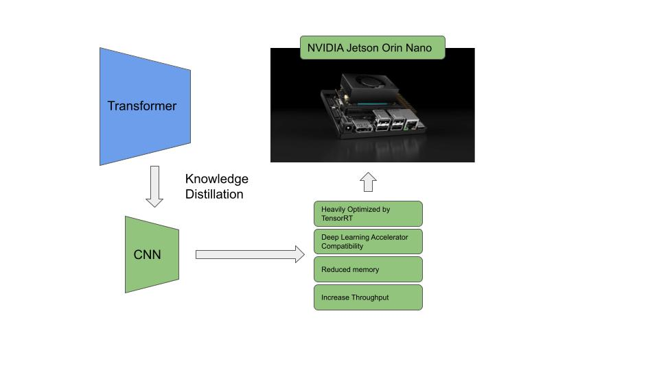
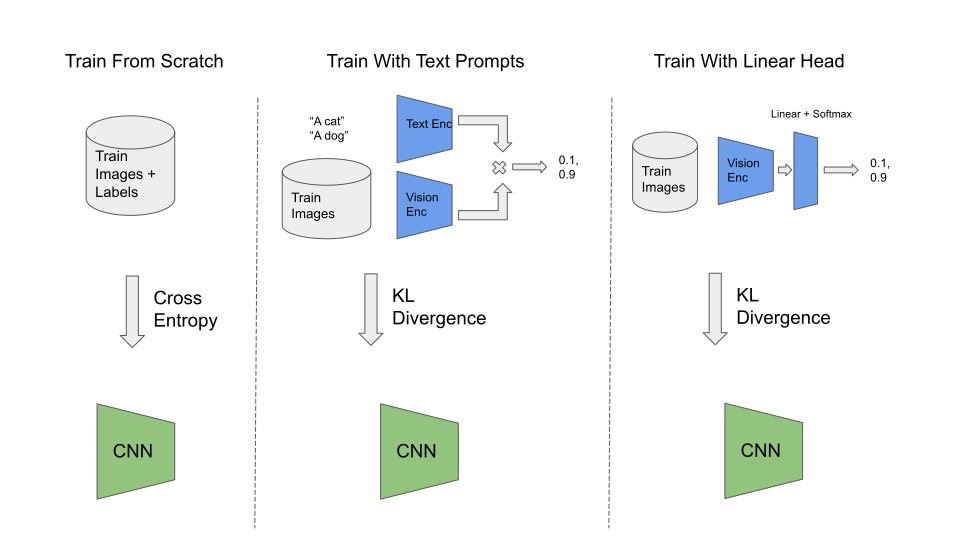

# Jetson Knowledge Distillation

This project contains tutorials, examples and code that demonstrate how to use
knowledge distillation to optimize large foundational models for inference at
 the edge.  

> We'd love to hear how you're interested in using knowledge distillation for Jetson!
> Are there models you'd like to see distilled?  Have you done any work distilling
> models for Jetson?  [Let us know!](#)

### Tutorial 1 - Introduction to knowledge distillation

We'll introduce some concepts in knowledge distillation and talk about important
aspects that can impact accuracy of distilled models.  We do this by investigating
distilling a CNN to mimic OpenCLIP as a classifier for the STL10 toy image 
classification dataset.  We'll see how zero-shot accuracy compares to linear probing,
and understand the importance of the data used during the distillation process.

Get started by following the tutorial [here](part_1_intro_to_distillation/README.md).

### Tutorial 2 - Create your own zero-label image clasifier

Using our learnings from the first tutorial, we'll move on to apply distillation
in practice.  We'll create our own custom image classifier, without needing to
label or curate any data.  We'll do this by automatically download CLIP-filtered
images from the LAION dataset, and training a CNN model to mimic an OpenCLIP
model for our data.  We include all the scripts needed to do this, and this
workflow can be readily extended to your own arbitrary image classification task.
The scripts include advanced features like training for structured sparsity,
quantization aware training, and deploying with NVIDIA TensorRT.  We also 
include demo scripts from running the final model on live video or pictures.

Get started by following the tutorial [here](part_2_zero_label_classifier/README.md).