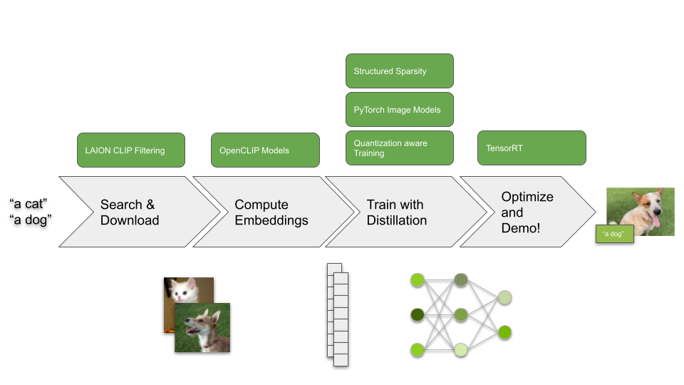

# CLIP Knowledge Distillation




This repository contains code and instructions that enable you
to create your own customized image classification models
with zero-labeled data, by performing knowledge distillation of OpenCLIP models.

Even if you don't need an image classifier directly, you may find this project helpful as inspiration for how you can use knowledge distillation to optimized models for inference, or as an example of how to train models with quantization aware training and structured sparsity for inference on NVIDIA Jetson. 

This project includes,

1. Scripts to search and download relevant data from the LAION database to use for distillation
2. Scripts to distil any OpenCLIP model to any Pytorch image models (timm) CNN model.
    - Supports Quantization Aware Training (QAT) for downstream INT8 inference
    - Supports training to enforce 2:4 structured sparsity with the ASP library
3. Scripts to run inference with NVIDIA TensorRT
    - Supports INT8 model
    - Supports acceleration of 2:4 structured sparse models on certain NVIDIA Jetson platforms, like NVIDIA Jetson Orin Nano.

To get started, follow the instructions below.

> If you're new to the subject, check out our tutorial [jetson-intro-to-distillation](https://github.com/NVIDIA-AI-IOT/jetson-intro-to-distillation)
> for an introduction to knowledge distillation!


## Instructions

1. [Step 1 - Search and download relevant unlabeled images to use for distillation](#step-1)
2. [Step 2 - Pre-compute OpenCLIP embeddings](#step-2)
3. [Step 3 - Train the student CNN model to mimic the OpenCLIP model](#step-3)
4. [Step 4 - Run inference using the distilled model](#step-4)
5. [Step 5 (advanced) - Train a student model with structured sparsity](#step-5)
6. [Step 6 (advanced) - Train a student with Quantization aware training and INT8 precision](#step-6)
7. [Next Steps](#next-steps)

<a name="step-1"></a>

## Step 1 - Search and download images with CLIP filtering

### Search for relevant image URLs in the LAION database using CLIP filtering

The first thing we need to do when distilling a model, is obtain data to use for distillation. 

For this task, we'll look for relevant images by searching the LAION database.  We've provided a script to make this simple.

To search for relevant images, first create a file ``data/text_prompts.txt`` with the text prompts to query.

Each prompt should exist on it's own line.

```txt
a dog
a cat
```

Next, call the script to query the images that match the text prompts.

```bash
python3 search_clip_images.py \
    "data/text_prompts.txt" \
    "data/image_urls.txt" \
    -n 5000 \
    -m 10000 \
    --max_workers 2 \
    --append
```

This will output a file ``data/image_urls.txt`` that contains the URLs of images matching our text prompt queries.

For the full set of arguments please type

```bash
python3 search_clip_images.py --help
```

### Download images from URL file

Now that we've found relevant images to use for distillation, we need to download them.

To do so, we call the following script to download images to an output folder.

```bash
python3 download_images.py \
    "data/image_urls.txt" \
    "data/images" \
    --max_workers 32 \
    --timeout 2
```

This script will download images to the folder ``data/images``.  Each image
will be given a unique filename base on it's URL.  

For the full set of arguments please type

```bash
python3 download_images.py --help
```

<a name="step-2"></a>

## Step 2 - Compute OpenCLIP embeddings

The images we downloaded above will be used as inputs to our teacher and student models during distillation.  Unfortunately, it can be slow to execute the teacher during training.  

To speed up this process, we'll pre-compute the outputs of our teacher model so we don't need to execute the teacher model during training.

To do this, call the ``compute_openclip_embeddings.py`` script as follows,

```bash
python3 compute_openclip_embeddings.py \
    data/images \
    data/embeddings \
    --batch_size 16 \
    --num_workers 8 \
    --model_name ViT-B-32 \
    --pretrained laion2b_s34b_b79k
```

This will write the ouptput embeddings to the folder ``data/embeddings``, with filenames that match the image filenames, except for the file extensions.

> Note: For available model names and pretrained weight identifiers please reference [OpenCLIP Repo](https://github.com/mlfoundations/open_clip/blob/fb72f4db1b17133befd6c67c9cf32a533b85a321/src/open_clip/pretrained.py#L227).

For the full set of arguments please type

```bash
python3 compute_openclip_embeddings.py --help
```

<a name="step-3"></a>

## Step 3 - Train the student CNN model to mimic the OpenCLIP model

Now that we have the data to use for knowledge distillation, we can perform the distillation (student model training) by calling the ``distil_model_embeddings.py`` script as follows.

```bash
python3 distil_model_embeddings.py \
    resnet18 \
    data/images \
    data/embeddings \
    data/models/resnet18 \
    --output_dim 512 \
    --pretrained
```

This will output model checkpoints and information to ``data/models/resnet18``.

The distilled model we use in this example is resnet18.  This model is highly optimized by TensorRT, and we can readily apply other optimizations like reduced precision and structured sparsity during training.  Please see the additional steps below for more information.

For the full set of arguments please type

```bash
python3 distil_model_embeddings.py --help
```


<a name="step-4"></a>

## Step 4 - Run inference using the distilled model

### Compute text embeddings

During distillation, we trained our student model to match the *features* of our open-clip model.  However, we're interested in creating a classification model.

To create the zero-shot classification model, we need to generate text embeddings from the text prompts that describe our class labels.

To do so, we use the pre-trained OpenCLIP text encoder.

We call the ``compute_openclip_text_embeddings.py`` script to create the text embeddings.

```bash
python3 compute_openclip_text_embeddings.py \
    data/text_prompts.txt \
    data/text_embeddings.npy \
    --model_name ViT-B-32
```

In this instance, we used the same text prompts we used for image search as our text prompts for classification.  

### Predict single image with PyTorch

Now that we have computed th text prompts for our image classes, we can perform image classification with our PyTorch model as follows:

```bash
python3 predict_pytorch.py \
    resnet18 \
    data/models/resnet18/checkpoint.pth \
    data/text_embeddings.npy \
    assets/cat.jpg \
    --text_prompts data/text_prompts.txt
```

### Live demo with camera

We can similarily perform inference on a live camera feed as follows:

```bash
python3 demo_pytorch.py \
    resnet18 \
    data/models/resnet18/checkpoint.pth \
    data/text_embeddings.npy \
    --text_prompts data/text_prompts.txt \
    --camera_device 0
```

## Step 5 (advanced) - Train a student model with structured sparsity

The training script offers the ability to train for [structured sparsity](https://developer.nvidia.com/blog/accelerating-inference-with-sparsity-using-ampere-and-tensorrt/).  This can offer additional acceleration when deploying the model on applicable NVIDIA Jetson platforms with TensorRT.

### Train the model with structured sparsity

```bash
python3 distil_model_embeddings.py \
    resnet18 \
    data/images \
    data/embeddings \
    data/models/resnet18_sparse \
    --output_dim 512 \
    --pretrained \
    --init_checkpoint data/models/resnet18/checkpoint.pth \
    --use_asp \
    --num_epochs 25
```

### Predict with PyTorch

```bash
python3 predict_pytorch.py \
    resnet18 \
    data/models/resnet18_sparse/checkpoint.pth \
    data/text_embeddings.npy \
    assets/cat.jpg \
    --text_prompts data/text_prompts.txt \
    --use_asp
```

### Demo with PyTorch

```bash
python3 demo_pytorch.py \
    resnet18 \
    data/models/resnet18_sparse/checkpoint.pth \
    data/text_embeddings.npy \
    --text_prompts data/text_prompts.txt \
    --camera_device 0 \
    --use_asp
```

### Export to ONNX

```bash
python3 export_onnx.py \
    resnet18 \
    data/models/resnet18_sparse/checkpoint.pth \
    data/onnx/resnet18_sparse.onnx \
    --use_asp
```


<a name="step-6"></a>

## Step 6 (advanced) - Train a student with Quantization aware training and INT8 precision

In addition to structured sparsity, another technique we can use for additional performance is by using reduced INT8 precision.  Quantization aware training is a technique to minimize quantization errors introduced when deploying with INT8 precision.  It does so by applying quantization during the model forward pass during training.  This allows the model to adapt to quantization errors during training.  It also allows us to avoid the need for calibration when using post-training quantization.

To distil the model with quantization aware training, follow theses steps

### Train the model with quantization aware training (QAT)

```bash
python3 distil_model_embeddings.py \
    resnet18 \
    data/images \
    data/embeddings \
    data/models/resnet18_qat \
    --output_dim 512 \
    --pretrained \
    --init_checkpoint data/models/resnet18/checkpoint.pth \
    --use_qat \
    --num_epochs 25
```

### Predict with PyTorch

```bash
python3 predict_pytorch.py \
    resnet18 \
    data/models/resnet18_sparse/checkpoint.pth \
    data/text_embeddings.npy \
    assets/cat.jpg \
    --text_prompts data/text_prompts.txt \
    --use_qat
```

### Demo with PyTorch

```bash
python3 demo_pytorch.py \
    resnet18 \
    data/models/resnet18_sparse/checkpoint.pth \
    data/text_embeddings.npy \
    --text_prompts data/text_prompts.txt \
    --camera_device 0 \
    --use_qat
```

### Export to ONNX

```bash
python3 export_onnx.py \
    resnet18 \
    data/models/resnet18_qat/checkpoint.pth \
    data/onnx/resnet18_qat.onnx \
    --use_qat
```

<a name="next-steps"></a>

## Next steps

We hope you found this project helpful and that you were able to train your own image classification model, without using any labeled data.  

As a next step, we recommend reading through the source code to see how we used knoweldge distillation in this project.  We also recommend reading the source code to see how you can train a model with the convenient libraries in PyTorch for quantization aware training and structured sparsity, for more optimized inference on Jetson.

If you have any questions, or run into any issues, please let us know by opening an issue on GitHub!