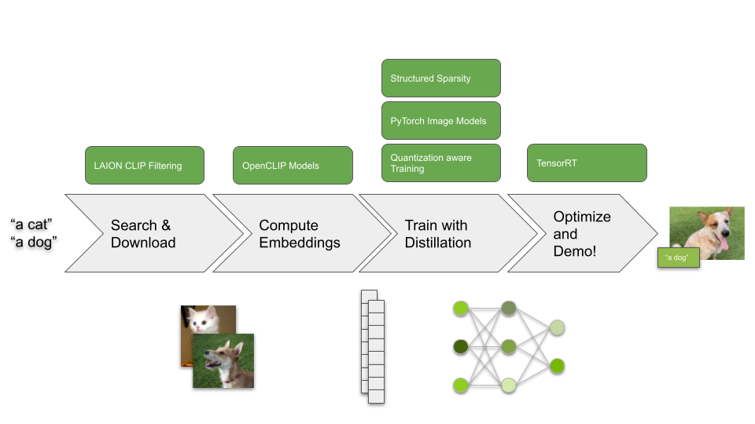

# Tutorial 2 - Zero-label Image Classifier



In the previous tutorial, we convered the fundamentals of knowledge distillation,
and demonstrated some of the important factors that can impact accuracy.  

While that was helpful for learning about how different factors can impact 
distillation accuracy, the STL10 dataset, at 96x96 resolution with just 10 classes
isn't really all the practically useful.  But one important thing we learned, is that we can achieve good classification accuracy using feature distillation without
ground truth labels. We also learned that the accuracy was largely dependent
on the data used for distillation.

So the remaining challenging in creating a classification model is largely
how we curate the data and train a model with custom configurations.

In this tutorial we'll demonstrate a streamlined approach for distilling OpenCLIP
to make a model without using an labeled data.  This tutorial includes a set of tools for curating data and training
a CLIP model so you can accomplish this task with ease.

## Table of Contents

1. Search images using CLIP filtering
2. Download images from URLs
3. Compute OpenCLIP embeddings
4. Compute OpenCLIP text embeddings
5. Distil OpenCLIP embeddings to Timm Model
6. Test model on image
7. Test model on live video
6. Distil model with structured sparsity
7. Distil model with Quantization Aware Training (QAT)
8. Optimize with TensorRT
9. Demo with TensorRT on live video

## Search and download images with CLIP filtering

First, let's query for image URLS that match a set of text prompts by using
the LAION clip retrieval service.

First, create a file ``data/text_prompts.txt`` with the text prompts to query.
Each prompt should exist on it's own line.

```txt
a dog
a cat
```

Next, query the images based on the text prompts.

```bash
python3 search_clip_images.py \
    "data/text_prompts.txt" \
    "data/image_urls.txt" \
    -n 5000 \
    -m 10000 \
    --max_workers 2 \
    --append
```

> Note: We use our own script rather than clip_retrieval because it does not expose some parameters and limits the number of images downloaded to a larger extent.

For the full set of arguments please type

```bash
python3 search_clip_images.py --help
```

## Download images from URL file

Next, we call the following script to download images to an output folder.
Images are assigned a unique ID based on their URL using the uuid library.  
This allows us to track the association of images with their URLs without
needing extra metadata or files.

```bash
python3 download_images.py \
    "data/image_urls.txt" \
    "data/images" \
    --max_workers 32 \
    --timeout 2
```

For the full set of arguments please type

```bash
python3 download_images.py --help
```


## Compute OpenCLIP embeddings

Now that we've downloaded a set of images, let's compute OpenCLIP embeddings.
This will speed up training, so we don't have to run CLIP in the training loop.

```bash
python3 compute_openclip_embeddings.py \
    data/images \
    data/embeddings \
    --batch_size 16 \
    --num_workers 8 \
    --model_name ViT-B-32 \
    --pretrained laion2b_s34b_b79k
```

> Note: For available model names and pretrained weight identifiers please reference [OpenCLIP Repo](https://github.com/mlfoundations/open_clip/blob/fb72f4db1b17133befd6c67c9cf32a533b85a321/src/open_clip/pretrained.py#L227).

For the full set of arguments please type

```bash
python3 compute_openclip_embeddings.py --help
```

## Distil OpenCLIP embeddings to Timm Model

```bash
python3 distil_model_embeddings.py \
    resnet18 \
    data/images \
    data/embeddings \
    data/models/resnet18 \
    --output_dim 512 \
    --pretrained
```

For the full set of arguments please type

```bash
python3 distil_model_embeddings.py --help
```

## Compute text embeddings

Before we can use our distilled model for classification, we need to compute 
the text embeddings.

```bash
python3 compute_openclip_text_embeddings.py \
    data/text_prompts.txt \
    data/text_embeddings.npy \
    --model_name ViT-B-32
```

The model name should match that in step (3).  The text prompts here match
those we used for search.  If you distilled the model with other text prompts,
you could set this to just the prompts you want to use for classification.

## Predict single image with PyTorch

To run inference on a single image with PyTorch

```bash
python3 predict_pytorch.py \
    resnet18 \
    data/models/resnet18/checkpoint.pth \
    data/text_embeddings.npy \
    assets/cat.jpg \
    --text_prompts data/text_prompts.txt
```


## Live demo with camera

To run inference on a live camera feed and print results to terminal

```bash
python3 demo_pytorch.py \
    resnet18 \
    data/models/resnet18/checkpoint.pth \
    data/text_embeddings.npy \
    --text_prompts data/text_prompts.txt \
    --camera_device 0
```

## Train model for structured sparsity 

### Distil

```bash
python3 distil_model_embeddings.py \
    resnet18 \
    data/images \
    data/embeddings \
    data/models/resnet18_sparse \
    --output_dim 512 \
    --pretrained \
    --init_checkpoint data/models/resnet18/checkpoint.pth \
    --use_asp \
    --num_epochs 25
```

### Predict with PyTorch

```bash
python3 predict_pytorch.py \
    resnet18 \
    data/models/resnet18_sparse/checkpoint.pth \
    data/text_embeddings.npy \
    assets/cat.jpg \
    --text_prompts data/text_prompts.txt \
    --use_asp
```

### Demo with PyTorch

```bash
python3 demo_pytorch.py \
    resnet18 \
    data/models/resnet18_sparse/checkpoint.pth \
    data/text_embeddings.npy \
    --text_prompts data/text_prompts.txt \
    --camera_device 0 \
    --use_asp
```

### Export to ONNX

```bash
python3 export_onnx.py \
    resnet18 \
    data/models/resnet18_sparse/checkpoint.pth \
    data/onnx/resnet18_sparse.onnx \
    --use_asp
```

## Train model with Quantization Aware Training (QAT)

### Distil

```bash
python3 distil_model_embeddings.py \
    resnet18 \
    data/images \
    data/embeddings \
    data/models/resnet18_qat \
    --output_dim 512 \
    --pretrained \
    --init_checkpoint data/models/resnet18/checkpoint.pth \
    --use_qat \
    --num_epochs 25
```

### Predict with PyTorch

```bash
python3 predict_pytorch.py \
    resnet18 \
    data/models/resnet18_sparse/checkpoint.pth \
    data/text_embeddings.npy \
    assets/cat.jpg \
    --text_prompts data/text_prompts.txt \
    --use_qat
```

### Demo with PyTorch

```bash
python3 demo_pytorch.py \
    resnet18 \
    data/models/resnet18_sparse/checkpoint.pth \
    data/text_embeddings.npy \
    --text_prompts data/text_prompts.txt \
    --camera_device 0 \
    --use_qat
```

### Export to ONNX

```bash
python3 export_onnx.py \
    resnet18 \
    data/models/resnet18_qat/checkpoint.pth \
    data/onnx/resnet18_qat.onnx \
    --use_qat
```

